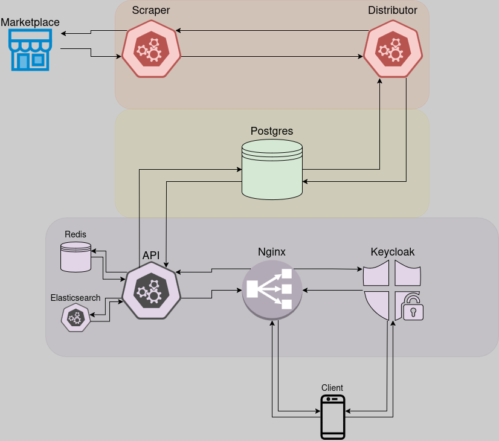

# Псевдоскидки

Многие магазины устраивают скидки.
Однако периодически это никакие не скидки, а по сути настоящая цена, просто переоформленная.
Чтобы это выявить, нужно вести историю наблюдений за ценой,
но рандомному пользователю невозможно сделить за всеми товарами в течение длительного времени.
Данный проект призван решить эту проблему.

## Архитектура

Данный проект состоит из нескольких приложений:

- [Scraper](https://github.com/akamishanya/pseudo-discounts-scraper) - приложение, отвечающее за
  получение полезных данных о товаре (таких, как, например, название товара, цена на товар и т. д.)
  по ссылке на этот товар на маркетплейсе. Ссылка на товар приходит в Scraper через брокер сообщений
  от приложения Distributor.
- [Distributor](https://github.com/akamishanya/pseudo-discounts-distributor) - приложение,
  отвечающее за получение из базы данных ссылок на товары, передачу этих ссылок в Scraper и
  сохранение полученных от Scraper полезных данных о товаре в базу данных.
  Контейнер с приложением периодически запускается планировщиком задач операционной системы
  (например, через cron).
- [База данных](https://github.com/akamishanya/pseudo-discounts-database) (используется Postgres)
  хранит информацию о маркетплейсах, товарах, пользователях и так далее. С ней взаимодействует как
  Distributor, так и API.
- API - приложение, реализующее логику обработки запросов от клиентов.
- Также в проекте дополнительно используются:
  - Redis для кэширования результатов из основной базы данных.
  - Elasticsearch для управления и анализа логов.
  - Nginx для фильтрации и проксирования запросов к API.
  - Keycloak для управления аутентификацией и авторизацией.

## Планы

### До начала весеннего семестра 2025 года:
- [X] Реализовать базовый прототип прилоежния Scraper, поддерживающий один маркетплейс.
- [ ] Реализовать приложение Distributor.
- [X] Спроектировать базу данных.
- [ ] Протестировать взаимодействие приложений Scraper, Distributor и базы данных.
- [ ] Реализовать поддержку как минимум еще одного маркетплейса.

### До конца весеннего семестра 2025 года:
- [ ] Реализовать API для обработки запросов от клиентов.
- [ ] Реализовать поддержку Redis.
- [ ] Реализовать поддержку Elasticsearch.
- [ ] Реализовать поддержку Nginx.
- [ ] Реализовать поддержку Keycloak.
- [ ] Реализовать прототип клиентского мобильного приложения.
